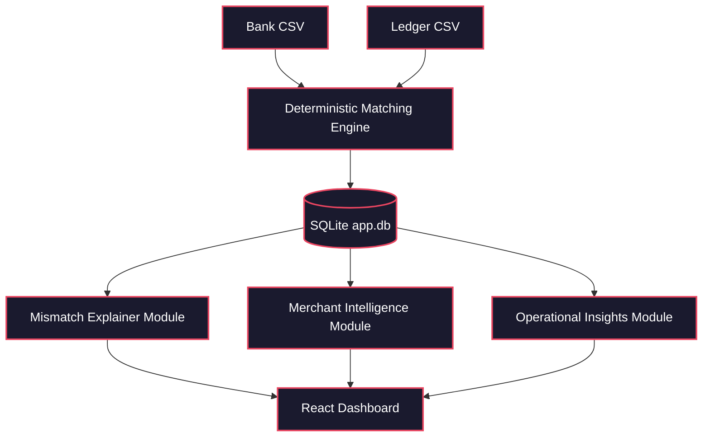
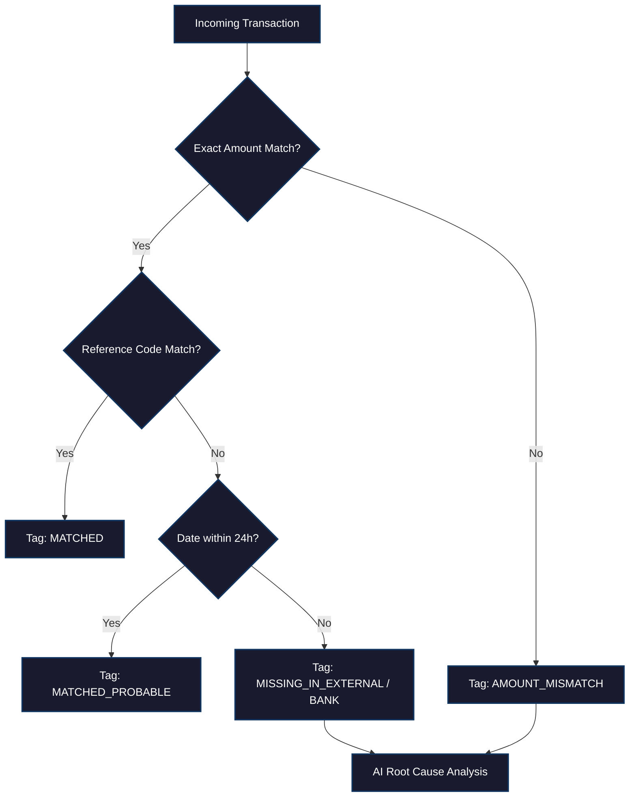
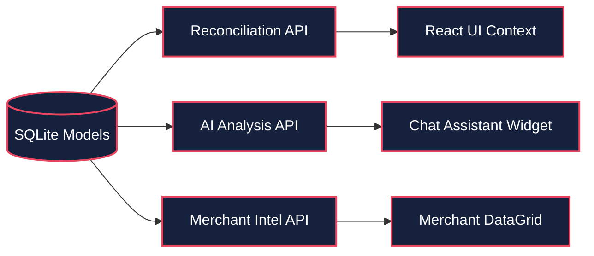

# BANK AI - Financial Reconciliation Audit Intelligence System

> **Deterministic reconciliation, zero hallucination tolerance, explainable audit trails at every stage.**

BANK AI is an enterprise-grade financial reconciliation engine that leverages deterministic matching rules augmented by advanced AI explanation models to provide high-fidelity insights into ledger-to-bank discrepancies, minimizing manual audit overhead for financial teams.

## Table of Contents
1. [System Architecture](#system-architecture)
2. [Pipeline Overview](#pipeline-overview)
3. [Service Registry](#service-registry)
4. [Schema Registry](#schema-registry)
5. [Project Structure](#project-structure)
6. [Setup and Configuration](#setup-and-configuration)
7. [Running the System](#running-the-system)
8. [API Reference](#api-reference)
9. [Evaluation Framework](#evaluation-framework)
10. [Design Philosophy](#design-philosophy)
11. [Safety Mechanisms](#safety-mechanisms)
12. [Known Limitations](#known-limitations)
13. [Remaining Work and Roadmap](#remaining-work-and-roadmap)
14. [Technology Stack](#technology-stack)
15. [License](#license)

## System Architecture

BANK AI strictly separates deterministic data matching from AI-driven insights. Financial records from bank statements and external ledgers are first parsed and reconciled using strict, rule-based Python logic (exact amounts, reference codes, date proximity). The output is persisted to a localized SQLite database. Only post-reconciliation, specific data slices are routed to the Groq-powered LLM (Llama-3 70B) to generate human-readable deep-dive explanations, merchant analytics, and high-level operational summaries. 

### High-Level Pipeline


### Decision Flowchart


### Data Flow Between Modules


> **System Guarantee:** AI models are strictly forbidden from modifying underlying financial data or altering reconciliation states; they possess read-only access for analytical summarization only.

## Pipeline Overview

| Phase | Module | Purpose | Input | Output |
|---|---|---|---|---|
| Ingestion | Upload Service | Parse raw CSV statements | Bank & Ledger CSV files | Standardized SQLite Tables |
| Reconciliation | Matching Engine | Cross-reference records deterministically | Parsed SQLite Records | ReconciliationResult entries |
| Intelligence | Mismatch Explainer | Generate human-readable reasons for failure | ReconciliationResult | Root-cause text explanation |
| Aggregation | Merchant Intel | Analyze vendor-level anomalies and friction | Grouped Transactions | Merchant Analytics JSON |
| Reporting | AI Summary Service | Generate executive-level session briefs | Session Data | High-level Markdown |

## Service Registry

| Component | File | Method/Endpoint | LLM Usage | Deterministic Logic |
|---|---|---|---|---|
| Matching | `reconciliation_service.py` | `process_reconciliation` | No | Strict equality & proximity rules |
| Mismatch Explainer | `mismatch_explanation_service.py`| `explain_mismatch` | Yes (Groq) | Context extraction |
| Merchant Intel | `merchant_intelligence_service.py` | `get_merchant_deepdive` | No | Date-range slicing & percentage math |
| Session Summary | `ai_summary_service.py` | `generate_session_summary` | Yes (Groq) | Data aggregation |

## Schema Registry

| Schema | File | Key Fields |
|---|---|---|
| `ReconciliationSession` | `models/base.py` | `id`, `total_bank_records`, `total_ledger_records`, `mismatched_records` |
| `Transaction` | `models/base.py` | `amount`, `transaction_date`, `description`, `reference` |
| `ReconciliationResult` | `models/base.py` | `match_type`, `bank_transaction_id`, `ledger_transaction_id` |

## Project Structure

```text
BANK AI
|-- backend/                      # FastAPI Python Backend
|   |-- main.py                   # Application entrypoint
|   |-- app.db                    # Local SQLite Database
|   |-- app/
|       |-- api/
|       |   |-- v1/
|       |       |-- ai.py         # AI inference endpoints
|       |       |-- investigation.py # Investigation & analytics endpoints
|       |       |-- reconciliation.py # File upload and matching endpoints
|       |-- models/
|       |   |-- base.py           # SQLAlchemy declarative models
|       |-- services/
|           |-- ai_summary_service.py # Groq prompt engineering for session summaries
|           |-- merchant_intelligence_service.py # Merchant analytics and breakdown
|           |-- mismatch_explanation_service.py # Granular mismatch AI analysis
|-- frontend/                     # React Frontend (Create React App)
|   |-- public/                   # Static assets
|   |-- src/
|   |   |-- App.tsx               # Main dashboard view
|   |   |-- index.css             # Tailwind configuration
|   |-- components/
|   |   |-- ai-audit-drawer.tsx   # Portal-based UI overlay for AI mismatch reviews
|   |   |-- error-boundary.tsx    # React error catching
|   |-- context/
|   |   |-- reconciliation-context.tsx # Global state management
|   |-- features/
|       |-- ai-assistant/         # Floating chat assistant logic
|       |-- investigation/        # Deep-dive data grids and charts
```

## Setup and Configuration

1. **Clone the repository:**
   ```bash
   git clone https://github.com/patareshivraj/AI-Powered-Financial-Reconciliation-Audit-Intelligence-System.git
   cd AI-Powered-Financial-Reconciliation-Audit-Intelligence-System
   ```

2. **Backend Setup (Python):**
   ```bash
   cd backend
   python -m venv .venv
   source .venv/Scripts/activate  # Windows: .venv\Scripts\activate
   pip install -r requirements.txt
   ```

3. **Frontend Setup (Node.js):**
   ```bash
   cd frontend
   npm install --legacy-peer-deps
   ```

> **For DevOps / Production Deployment:** Please see [frontend/README_DEVOPS.md](frontend/README_DEVOPS.md) for strict production deployment guidelines, Nginx routing, and `.env.production` setup.

4. **Environment Variables:**
   Create a `.env` file in the `backend/` directory:
   ```env
   GROQ_API_KEY=gsk_your_api_key_here
   DB_URL=sqlite:///./app.db
   ```

## Running the System

### Option A: Standard Development Servers
Start both servers independently in two terminals.
**Terminal 1 (Backend):**
```bash
cd backend
python main.py
```
**Terminal 2 (Frontend):**
```bash
cd frontend
npm start
```

### Key API Endpoints
| Method | Endpoint | Description |
|---|---|---|
| POST | `/api/v1/reconciliation/upload` | Uploads and deterministically reconciles CSV files. |
| GET | `/api/v1/reconciliation/{session_id}/results` | Retrieves all mismatch records. |
| POST | `/api/v1/ai/explain/{result_id}` | Triggers LLM explanation for a single discrepancy. |
| GET | `/api/v1/investigation/merchant/{merchant}` | Fetches detailed merchant AI summary and transactions. |

## API Reference

### Trigger AI Mismatch Explanation
**POST** `/api/v1/ai/explain/{result_id}`
```json
// Request Body (Empty)
{}
```
```json
// Response
{
  "explanation": "The transaction for AWS SERVICES is present in the bank statement but entirely missing from the ledger. This indicates an unrecorded expense, likely due to a missing procurement receipt.",
  "confidence": 0.95,
  "suggested_action": "Request invoice from engineering department."
}
```

| Error Code | Meaning |
|---|---|
| 404 | Result ID not found in database |
| 422 | Invalid payload or missing associated records |

## Evaluation Framework

We measure accuracy through strict deterministic test suites before evaluating AI outputs.
Run tests via: `pytest tests/`

| Metric | What It Measures | Target |
|---|---|---|
| Deterministic Matching | % of correctly identified exact matches | 100% |
| False Positive Rate | AI hallucinated explanations | < 1% |
| Context Utilization | How accurately AI references DB values | > 99% |

```json
{
  "last_run": "2026-06-04",
  "deterministic_match_accuracy": 100.0,
  "ai_hallucination_events": 0,
  "notes": "Strict prompt constraints applied in mismatch_explanation_service.py"
}
```

## Design Philosophy

1. **Deterministic Logic Precedes AI Analytics**
   Reconciliation is a math problem, not an AI problem. We use strict Python rules to match transactions. AI is exclusively used as an interpretative layer to explain *why* the deterministic engine failed to find a match.
2. **Zero Hallucination Tolerance via Context Injection**
   The LLM never queries the database. Instead, the backend extracts exact rows (`bank_transaction` and `ledger_transaction`), formats them into a strict dictionary, and injects them directly into the prompt context to prevent data hallucination.
3. **Decoupled Architecture**
   The React frontend and FastAPI backend operate independently. The UI is protected by Error Boundaries and Portals, ensuring that an AI failure (e.g., API timeout) never crashes the core reconciliation grids.
4. **Explainable Outputs**
   Every AI action generates a discrete `explanation` string that can be audited by a human. The system does not silently auto-correct ledgers.

## Safety Mechanisms

| Mechanism | Where It Applies | What It Prevents |
|---|---|---|
| Read-Only AI Services | `mismatch_explanation_service.py` | Prevents LLM from altering financial truths. |
| React Portals | `AiAuditDrawer` UI | Prevents visual overlap, z-index clipping, and CSS layout breakage. |
| Strict DB Typing | `models/base.py` | Prevents injection of invalid transaction states. |

## Known Limitations

| Limitation | Root Cause | Impact | Mitigation Path |
|---|---|---|---|
| Basic Merchant Parsing | Uses simple `.lower() in` substring matching | Edge case miscategorization | Implement fuzzy matching or NLP entity extraction |
| SQLite Concurrency | SQLite lock files (`.db-wal`) during hot-reloads | Potential UI timeouts on heavy loads | Migrate to PostgreSQL for production environments |
| Groq Rate Limits | Groq free tier strict TPM/RPM limits | Batch AI requests may fail | Implement a queuing system (e.g., Celery/Redis) with exponential backoff |

## Remaining Work and Roadmap

1. **Implement Celery Queues** 
   - **Why it matters:** To handle rate-limit bottlenecks when analyzing thousands of mismatches simultaneously.
   - **Effort:** Medium
2. **PostgreSQL Migration**
   - **Why it matters:** Ensures robust concurrent reads for multi-tenant enterprise deployment.
   - **Effort:** Medium
3. **Export to PDF/CSV Reports**
   - **Why it matters:** Finance teams require immutable snapshot exports of AI findings.
   - **Effort:** Low

| Feature | Reason for Exclusion |
|---|---|
| Auto-Correction | Financial ledgers require human sign-off; auto-correcting values is too high-risk for compliance. |

## Technology Stack

| Component | Technology |
|---|---|
| Backend Framework | FastAPI (Python 3.12) |
| Database | SQLite (SQLAlchemy ORM) |
| AI Inference | Groq API (Llama-3 70B) |
| Frontend Core | React 19 (Create React App) |
| UI/Styling | React, TailwindCSS, Lucide Icons |

## License
MIT License. Copyright (c) 2026 BANK AI Contributors.
