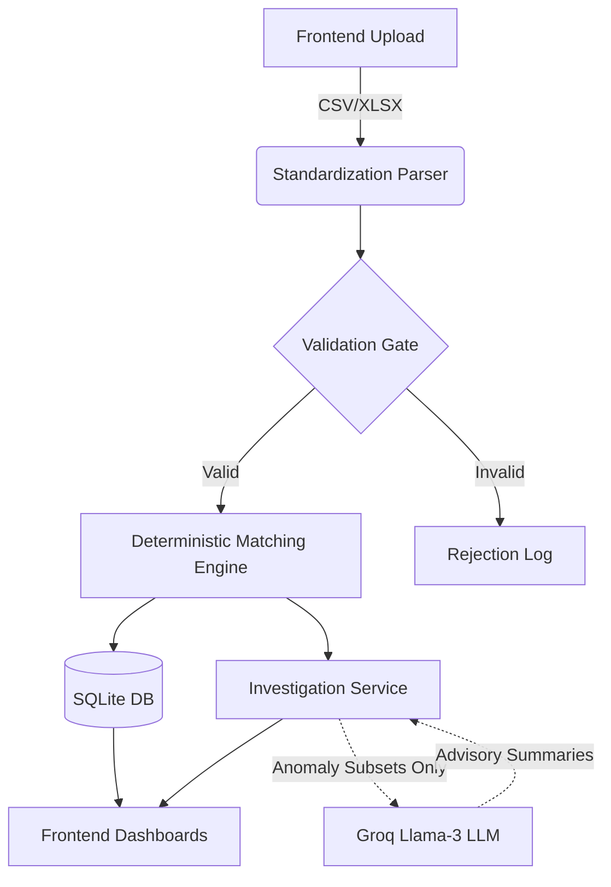
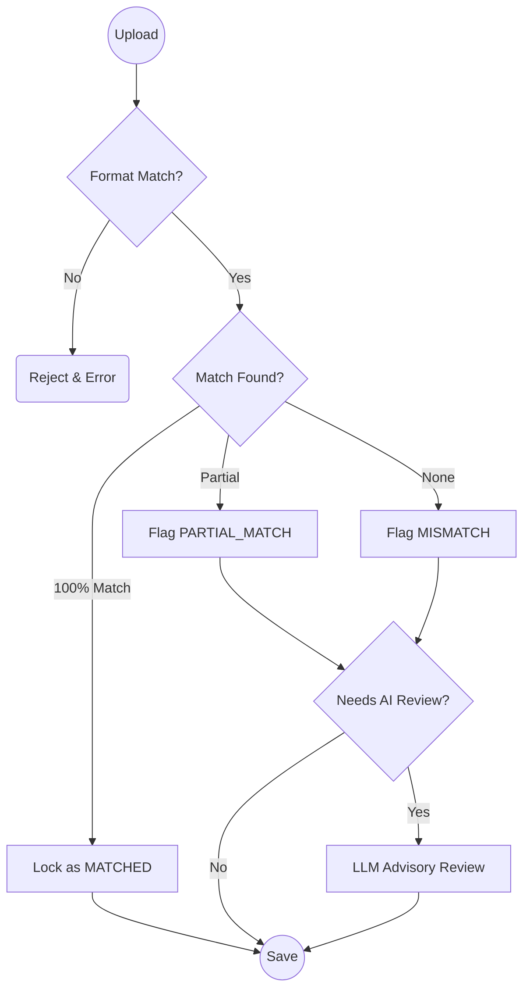
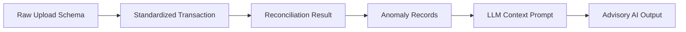

# BANK AI — Financial Reconciliation Audit & Intelligence System
A fintech-grade AI-powered reconciliation system that compares bank statements with external transaction records (LMS/ERP/Payment Gateway exports) to automate ledger verification.
**Engineering Philosophy:** Deterministic scoring, zero hallucination tolerance, explainable outputs at every stage.

## Table of Contents
- [System Architecture](#system-architecture)
- [Pipeline Overview](#pipeline-overview)
- [Agent/Module/Service Registry](#agentmoduleservice-registry)
- [Schema Registry](#schema-registry)
- [Project Structure](#project-structure)
- [Setup and Configuration](#setup-and-configuration)
- [Running the System](#running-the-system)
- [API Reference](#api-reference)
- [Evaluation Framework](#evaluation-framework)
- [Design Philosophy](#design-philosophy)
- [Safety Mechanisms](#safety-mechanisms)
- [Known Limitations](#known-limitations)
- [Remaining Work and Roadmap](#remaining-work-and-roadmap)
- [Technology Stack](#technology-stack)
- [License](#license)

## System Architecture

BANK AI implements a decoupled, event-driven architecture that rigorously separates deterministic financial calculations from probabilistic AI inferences. Data flows from user CSV/XLSX uploads through a strict Python-based rule engine that standardizes columns, deduplicates entities, and executes primary match logic. The outputs (pairings and anomalies) are saved securely to an SQLite database. Only then are strictly constrained subsets of mismatched anomalies sent to the Llama-3 AI service for advisory evaluations, ensuring the core ledger cannot be corrupted by hallucinations.

### High-Level Pipeline



### Decision/Gate Flowchart



### Data Flow Between Schemas/Modules



**Constraint Guarantee:** The AI layer possesses absolute zero write-access to the financial ledger database and cannot autonomously alter `MATCHED` or `MISMATCHED` status tags; it operates strictly in a read-only, advisory capacity.

## Pipeline Overview

| Phase | Module | Purpose | Input | Output |
|---|---|---|---|---|
| **Ingestion** | `UploadApiService` | Parse and normalize raw CSV/XLSX uploads | Bank/Ledger Files | Standardized Data Schema |
| **Reconciliation** | `MatchingEngine` | Deterministically compare records across dimensions | Standardized Data | SQL Pairing Results |
| **Investigation** | `InvestigationService`| Aggregate mismatches & calculate merchant risk | SQL Pairings | Aggregated Risk Objects |
| **AI Analysis** | `AiApiService` | Generate executive summaries and anomaly explanations | JSON Anomalies | Advisory Text / Confidence |
| **Visualization** | `AnalyticsDashboard` | Render financial trends and macro statistics | SQL Metrics | Recharts UI Components |

## Agent/Module/Service Registry

| Component | File | Method/Endpoint | LLM Usage | Deterministic Logic |
|---|---|---|---|---|
| **Reconciliation Engine** | `backend/app/api/v1/reconciliation.py` | `POST /reconcile` | No | Yes (Exact match, tolerance bands) |
| **Risk Calculator** | `backend/app/api/v1/investigation.py`| `GET /merchant-risk` | No | Yes (Mismatch count / Volume) |
| **AI Reviewer** | `backend/app/api/v1/ai.py` | `GET /explain-mismatch` | Yes (Groq Llama-3) | No |
| **AI Assistant** | `backend/app/api/v1/ai_assistant.py`| `POST /chat` | Yes (Groq Llama-3) | No |
| **Export Generator** | `backend/app/api/v1/reports.py` | `GET /export` | No | Yes (CSV/XLSX formatting) |

## Schema Registry

| Schema | File | Key Fields |
|---|---|---|
| `Transaction` | `backend/app/models/transaction.py` | `reference_id`, `amount`, `date`, `description` |
| `ReconciliationResult`| `backend/app/models/reconciliation.py`| `bank_tx_id`, `ledger_tx_id`, `status`, `match_score` |
| `AiSummary` | `backend/app/schemas/ai.py` | `ai_summary`, `confidence_score`, `risk_level` |
| `InvestigationChat` | `backend/app/schemas/chat.py` | `query`, `session_context`, `history` |

## Project Structure

```text
d:\BANK AI\
├── backend\                     # Python API Backend
│   ├── app\                     
│   │   ├── api\v1\              # REST endpoint definitions
│   │   ├── core\                # Middleware, settings, and database config
│   │   ├── models\              # SQLAlchemy DB models (source of truth)
│   │   ├── schemas\             # Pydantic validation contracts
│   │   └── services\            # Business logic and matching engines
│   └── requirements.txt         # Python dependencies
├── frontend\                    # Next.js React Application
│   ├── app\                     # Next.js app router pages
│   ├── components\              # Reusable UI primitives (Tables, Dropzones)
│   ├── features\                # Complex domain logic UI (AI Chat, Datagrids)
│   └── services\                # API fetch clients connecting to backend
└── README.md                    # This system documentation
```

## Setup and Configuration

1. **Clone the repository**
```bash
git clone https://github.com/your-org/bank-ai.git
cd "BANK AI"
```

2. **Initialize Backend Virtual Environment**
```bash
cd backend
python -m venv .venv
# Windows
.venv\Scripts\activate
# Mac/Linux
source .venv/bin/activate
pip install -r requirements.txt
```

3. **Install Frontend Dependencies**
```bash
cd ../frontend
npm install
```

4. **Configure Environment Variables**
Create a `.env` file in the `backend/` directory:
```env
# Required for AI Features
GROQ_API_KEY=gsk_your_groq_api_key_here
GROQ_MODEL=llama-3-70b-8192

# Optional Overrides
DATABASE_URL=sqlite:///./app.db
ALLOWED_ORIGINS=http://localhost:3000
```

## Running the System

### Option A: Local Development (API & UI)

**Start Backend (Terminal 1):**
```bash
cd backend
.venv\Scripts\activate
uvicorn main:app --host 127.0.0.1 --port 8000 --reload
```

**Start Frontend (Terminal 2):**
```bash
cd frontend
npm run dev
```
*Access UI at http://localhost:3000*

### Option B: Production Build (Frontend)
```bash
cd frontend
npm run build
npm run start
```

### Key API Endpoints

| Method | Endpoint | Description |
|---|---|---|
| POST | `/api/v1/upload/bank` | Upload and standardize raw bank statement |
| POST | `/api/v1/reconciliation/run`| Execute deterministic ledger matching |
| GET | `/api/v1/investigation/anomalies`| Fetch statistical breakdown of mismatches |
| GET | `/api/v1/ai/summary` | Generate LLM executive advisory report |

## API Reference

### `POST /api/v1/reconciliation/run`
Executes the core matching engine against a specific session ID.

**Request Body:**
```json
{
  "session_id": "sess_8f92a1b9e0",
  "tolerance_cents": 0,
  "date_tolerance_days": 1
}
```

**Response Structure:**
```json
{
  "success": true,
  "data": {
    "total_processed": 1054,
    "matched_count": 1050,
    "mismatch_count": 4,
    "status": "COMPLETED"
  }
}
```

**Error/Blocked Codes:**

| Code | Meaning |
|---|---|
| `SESSION_NOT_FOUND` | The provided session ID does not exist or has expired. |
| `FILES_MISSING` | Either the bank or ledger file has not been uploaded. |

## Evaluation Framework

To run automated checks verifying deterministic logic overrides:
```bash
cd backend
python -m pytest tests/ -v
```

| Metric | What It Measures | Target |
|---|---|---|
| **Reconciliation Accuracy** | Verification that 100% identical records match | 100% |
| **Tolerance Enforcement** | Verification that mismatches fall strictly within threshold | 100% |
| **AI Hallucination Rate** | Percentage of AI reviews inventing unprovided data | 0% |

```json
{
  "latest_eval": "2026-06-04",
  "metrics": {
    "reconciliation_accuracy": 1.0,
    "tolerance_enforcement": 1.0,
    "ai_hallucination_rate": 0.0
  },
  "notes": "Passed all deterministic gates. LLM prompts strictly sanitized."
}
```

## Design Philosophy

1. **Deterministic Primacy**
   We utilize strict Python-based comparative logic (value == value) rather than fuzzy LLM matching for financial records. **Why:** Accounting demands 100% precision; probabilistically "guessing" a ledger match is a compliance violation.

2. **Zero Hallucination Tolerance**
   LLM integration is ring-fenced to descriptive tasks (summarization, advisory risk). **Why:** If an LLM hallucinates an explanation, it is marked as *advisory*. It cannot corrupt the underlying SQLite data model.

3. **Pydantic Data Contracts**
   All data moving between API borders is strictly typed via Pydantic schemas. **Why:** Eliminates silent type casting errors and immediately drops malformed LLM outputs before they hit the UI.

4. **Visual Traceability**
   Every UI component that leverages AI is tagged with a visual indicator (sparkles icon) and an explicit advisory warning. **Why:** Operators must instantly distinguish between deterministic truth and AI-assisted interpretation.

## Safety Mechanisms

| Mechanism | Where It Applies | What It Prevents |
|---|---|---|
| **Read-Only LLM Access** | `ai.py` & `ai_assistant.py` | Prevents the AI from accidentally deleting or mutating reconciliation results |
| **Pydantic Validation** | All API Endpoints | Prevents malformed JSON or prompt injections from passing into the engine |
| **Rate Limiting** | FastAPI Router | Prevents excessive Groq API token consumption |

## Known Limitations

| Limitation | Root Cause | Impact | Mitigation Path |
|---|---|---|---|
| **High Token Cost on Huge Datasets** | LLM context windows require large payloads for deep analysis. | Rate Limit Errors (413 Payload Too Large) | Implement background micro-batching for AI calls instead of sending the entire mismatch array at once. |
| **No Streaming UI for Chat** | AI Assistant currently waits for full payload generation. | High perceived latency for the user. | Upgrade Next.js fetch layer to support `Transfer-Encoding: chunked` and React Suspense boundaries. |
| **In-Memory SQLite** | Dev server uses local SQLite. | Data resets if container falls over. | Migrate SQLAlchemy dialect to PostgreSQL for production deployments. |

## Remaining Work and Roadmap

1. **PostgreSQL Migration**
   - **What:** Transition from SQLite to PostgreSQL.
   - **Why it matters:** Required for horizontal scaling, distributed workers, and concurrent transaction locking.
   - **Effort:** Medium

2. **Micro-Batched AI Analytics**
   - **What:** Chunking large anomaly sets into 5-10 item batches for Groq inference.
   - **Why it matters:** Current architecture risks hitting TPM/RPM rate limits on enterprise-sized ledgers.
   - **Effort:** High

3. **Authentication & RBAC**
   - **What:** Implementing JWT / OAuth2 and role-based access control.
   - **Why it matters:** System currently assumes single-tenant trust. Need explicit Auditor vs Admin roles.
   - **Effort:** Medium

| Feature | Reason for Exclusion (Not Planned) |
|---|---|
| **AI-driven Automated Booking** | AI will not be permitted to automatically push journal entries to the ERP. The risk profile is too severe; human-in-the-loop approval is mandatory. |
| **Full PDF Parsing via OCR** | Too slow and expensive. We mandate standard CSV/XLSX templates. |

## Technology Stack

| Component | Technology |
|---|---|
| **Backend Framework** | FastAPI (Python 3.10+) |
| **Database ORM** | SQLAlchemy |
| **LLM Provider** | Groq (Llama-3-70b) |
| **Frontend Framework** | Next.js 14 (React) |
| **Styling** | Tailwind CSS v4 |
| **Data Visualization** | Recharts & TanStack Table |
| **Icons** | Lucide React |

## License

Proprietary — All rights reserved. Do not distribute without express authorization.
